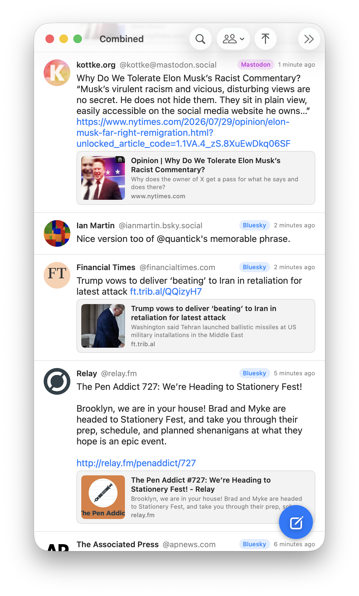
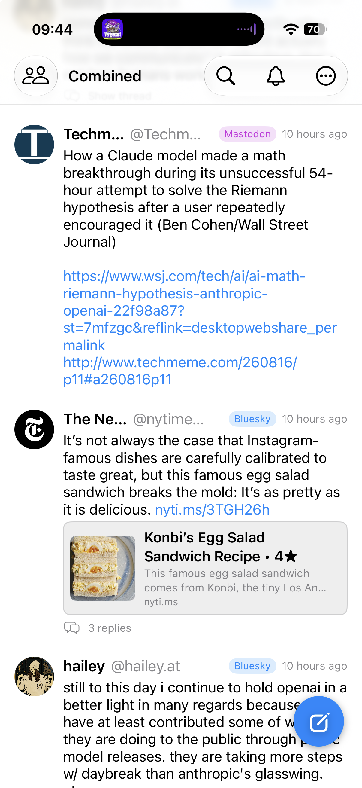

# Confluence

**One timeline. Two networks. Native on Mac and iPhone.**

Confluence brings your Bluesky and Mastodon feeds together in a single,
beautiful, chronological timeline — real native **macOS and iOS** apps, built
from one codebase, not a website in a window.

Your social world split in two. Your attention doesn't have to.

<p align="center">
  
  &nbsp;&nbsp;&nbsp;
  
</p>
<p align="center"><sub><b>macOS</b> &nbsp;·&nbsp; <b>iPhone</b> — one codebase, two native apps</sub></p>

## Install

### macOS

Grab the latest `.zip` from
[Releases](https://github.com/DanGahan/confluence/releases) — prod builds are
tagged `YYYYMMDD`, dev builds `DEV_YYMMDDHHMM` (prereleases).

1. Unzip; drag `Confluence.app` to `/Applications`.
2. Double-click. Gatekeeper will block it with "Apple could not verify
   Confluence.app is free of malware…" — this is expected for any app that
   isn't notarised by Apple.
3. **Approve it once**, either way works:
   - **System Settings** → **Privacy & Security** → scroll to the bottom
     → "Confluence was blocked to protect your Mac" → click **Open Anyway**
     → confirm with Touch ID / password. Then double-click Confluence again
     and pick **Open** on the follow-up dialog.
   - **Or, in Terminal**, run once:
     ```
     xattr -d com.apple.quarantine /Applications/Confluence.app
     ```
     Then double-click as normal.

The app is ad-hoc signed rather than notarised with an Apple Developer ID
($99/yr), so Gatekeeper doesn't allow the classic right-click → Open bypass
that older macOS versions had. Subsequent launches (and later versions
replacing the same bundle) don't re-prompt.

Version and the exact commit the build was cut from are shown in
**Confluence → About Confluence**.

### iPhone / iPad

The iOS app isn't distributed publicly yet — TestFlight needs an Apple Developer
account (tracked in the issues). For now, **build and run it from source** onto
your own device (see [For developers](#for-developers)); a free personal Apple
ID is enough to sideload via Xcode.

## Why Confluence

**🌊 One combined feed.** Posts from Bluesky and Mastodon, merged and sorted by
time — no algorithm deciding what you see, no switching between apps or tabs.
Each post carries a subtle badge so you always know where it came from. One
network having a bad day? The other keeps flowing.

**📡 Live mode.** Flip on live mode and the feed becomes a real-time ticker —
it pins to the top and streams new posts in as they land, refreshing every few
seconds while you're watching. It's considerate: polling pauses when the app
isn't frontmost and resumes the moment you come back. Flip it off to read at
your own pace.

**🖥 📱 Genuinely native, on both.** One Swift + SwiftUI codebase, two platforms
that each feel right. On **macOS** (Tahoe): Liquid Glass materials, the menu bar,
window tabs, and the keyboard shortcuts you expect (⌘N to post, ⌘R to refresh,
⌘T for a new tab, ⌘F to search). On **iPhone and iPad** (iOS 26): pull-to-refresh,
tap-to-reply, swipeable photo galleries, an in-app browser, and a layout that
adapts from iPhone SE to iPad. Dark Mode, your accent colour, Dynamic Type, and
VoiceOver throughout.

**✍️ Post once, reach everyone.** The cross-posting composer sends to Bluesky
and Mastodon in one go — with a character counter that tracks the tightest
limit, image attachments, drafts you can save and pick up later, and honest
per-network error handling: if one side fails, retry just that one. Never a
double post.

**💬 Quick reply, anywhere.** Tap a post to reply inline — in the feed, a
thread, a profile, or search — and it posts to the right network with your
account for that network.

**📸 Rich media, inline.** Photos preview at their natural shape — portrait,
landscape, or square, the whole image, scaled to your window (or switch to a
compact letterbox in settings). Open any photo in the lightbox to zoom (pinch
or tap) and swipe between a post's images. Videos and GIFs play right in the
feed — Bluesky clips and Mastodon videos alike. Link previews render as tidy
cards on both networks.

**💬 Follow the conversation.** Open any post's thread. Tap an @-mention or an
author to see their profile, and follow or unfollow on either network without
leaving the app.

**🔔 Notifications, unified.** Mentions, new followers, and boosts from both
networks in one chronological list, with an unread badge in the toolbar.

**🔎 Search everywhere at once.** One query, both networks, results split into
People and Posts — with follow buttons right in the results.

**📍 Picks up where you left off.** Confluence remembers your place in the
feed across launches, restores your window and tabs, and offers one-click
scroll-to-top when you want *now* instead of *then*.

**🔒 Private by design.** Your credentials live in the Keychain and nowhere
else. Sign in to Mastodon with standard OAuth in your browser — the app never
sees your password. Sandboxed, hardened, HTTPS-only, and zero third-party code:
nothing phones home, because there's nothing else in there.

## Getting started

1. **Bluesky:** sign in with your handle and an [app password](https://bsky.app/settings/app-passwords).
2. **Mastodon:** type your instance (like `mastodon.social`) and approve the
   app in your browser.
3. That's it. Your combined feed loads — either account works alone, too.

## Requirements

- **macOS 26 (Tahoe)** or later, or **iOS 26** or later (iPhone or iPad)
- A Bluesky account, a Mastodon account, or both

## For developers

Confluence is **Swift 6 + SwiftUI with zero dependencies**, built as a single
codebase that targets **macOS and iOS** — platform differences live behind
small `#if os(…)` seams, not an abstraction layer. All the business logic
(models, API clients, stores, merge/auth) lives in a fully unit-tested Swift
package, `ConfluenceKit`, so ~95% of the app is testable without launching it.

Start with [docs/PROJECT.md](docs/PROJECT.md) for the architecture tour,
[docs/SPEC.md](docs/SPEC.md) for the feature spec, [docs/IOS_PLAN.md](docs/IOS_PLAN.md)
for the iOS-port map, and [CLAUDE.md](CLAUDE.md) for the working agreements.

```bash
brew install xcodegen
scripts/create-dev-cert.sh                       # one-time macOS signing identity
xcodegen generate                                # generate Confluence.xcodeproj
swift test --package-path ConfluenceKit          # fast unit + integration tests

# macOS
xcodebuild -scheme Confluence -destination 'platform=macOS' build

# iOS (simulator)
xcodebuild -scheme Confluence -destination 'platform=iOS Simulator,name=iPhone 17' build
```

To run on a physical iPhone, open `Confluence.xcodeproj` in Xcode, set your
team under **Signing & Capabilities** (a free personal Apple ID works), pick
your device, and Run.
